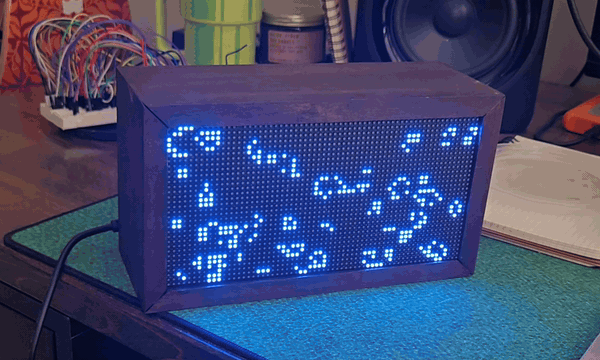

# LightBox



Raspberry Pi based Pixel-art style display that cycles through custom apps.

Maybe inspired by [TYDBYT](https://tidbyt.com/?srsltid=AU7gw4WfCfyjbUMqWveqrx8zOHccvySlT2Cnz3E5brFxxSw6OB7yuwQ5)

## Development

To run software using a local web UI, run:

```
./gradlew runLocal
```

## Configuration

This code is built on top of [hzeller's library](https://github.com/hzeller/rpi-rgb-led-matrix) and so many of the suggestions there apply to running this project. Ones I've found to be important are:
- Set isolcpus=3 in the /boot/firmware/cmdline.txt

## Deploying and Running
The Pi needs to be accesible via ssh to deploy. In the gradle script, it should have the alias `lightbox`
```
./gradlew deploy
```

For now, to run you will need to ssh into the pi and run via
```
sudo ~/code/light-box-build/bin/light-box
```
